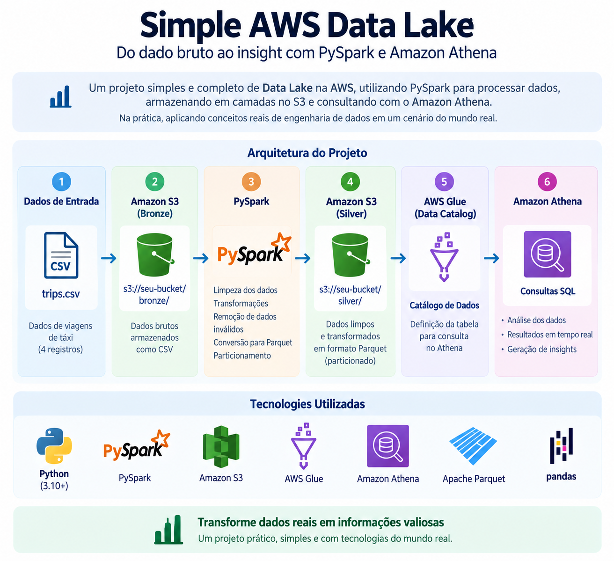

# Simple AWS Data Lake

Data Lake simples desenvolvido na AWS com **Amazon S3, PySpark, Apache Parquet e Amazon Athena**.

O projeto implementa um pipeline de Engenharia de Dados no qual dados brutos de viagens são armazenados no Amazon S3, processados com PySpark e disponibilizados em formato Parquet para consultas SQL com Amazon Athena.

## Arquitetura

```text
CSV → Amazon S3 Bronze → PySpark → Parquet → Amazon S3 Silver → AWS Glue → Amazon Athena → Analytics
```

### Diagrama da arquitetura



O fluxo está organizado em duas camadas principais:

- **Bronze:** preserva os dados brutos recebidos em CSV;
- **Silver:** contém os dados limpos, tipados e armazenados em formato Parquet.

O AWS Glue Data Catalog mantém a definição da tabela utilizada pelo Athena para consultar diretamente os arquivos da camada Silver.

## Tecnologias utilizadas

- Python
- PySpark 4.2
- Amazon S3
- AWS Glue Data Catalog
- Amazon Athena
- Apache Parquet
- SQL
- AWS CLI
- Git e GitHub

## Estrutura do projeto

```text
simple-aws-data-lake/
├── data/
│   └── trips.csv
├── docs/
│   └── architecture.png
├── src/
│   └── transform.py
├── sql/
│   └── athena_queries.sql
├── .env.example
├── .gitignore
├── requirements.txt
└── README.md
```

## Dados de entrada

O dataset representa viagens de transporte e contém os seguintes campos:

| Campo | Descrição |
|---|---|
| `trip_id` | Identificador da viagem |
| `trip_date` | Data da viagem |
| `distance_km` | Distância percorrida em quilômetros |
| `fare_amount` | Valor da viagem |
| `payment_type` | Forma de pagamento |

Exemplo:

```csv
trip_id,trip_date,distance_km,fare_amount,payment_type
1,2026-01-01,5.2,25.00,credit_card
2,2026-01-01,2.1,12.00,cash
3,2026-01-02,8.7,40.00,credit_card
4,2026-01-02,-1.0,15.00,cash
```

O último registro possui propositalmente uma distância negativa para validar a etapa de limpeza do pipeline.

## Funcionamento do pipeline

### 1. Camada Bronze

O arquivo CSV original é armazenado no Amazon S3 sem transformação.

```text
s3://<bucket>/bronze/trips/trips.csv
```

Essa camada representa os dados brutos recebidos pelo Data Lake.

### 2. Transformação com PySpark

O script `src/transform.py` lê os dados e aplica as regras de qualidade.

As principais transformações são:

- remoção de registros duplicados por `trip_id`;
- remoção de viagens com `distance_km <= 0`;
- remoção de registros com `fare_amount <= 0`;
- conversão de `trip_date` para o tipo `date`;
- gravação dos dados limpos em Apache Parquet.

O pipeline também lê novamente o Parquet gerado para validar a saída.

```bash
python src/transform.py
```

A saída local é criada em:

```text
output/silver/trips/
```

### 3. Camada Silver

Após a transformação, os arquivos Parquet são enviados para a camada Silver no Amazon S3.

```text
s3://<bucket>/silver/trips/
```

Essa camada contém somente registros válidos e preparados para análise.

O formato Parquet foi utilizado por ser colunar e adequado para workloads analíticos, permitindo leituras mais eficientes de dados.

### 4. AWS Glue Data Catalog

Uma tabela externa chamada `trips` é registrada no catálogo apontando para os arquivos Parquet da camada Silver.

Schema utilizado:

```text
trip_id        INT
trip_date      DATE
distance_km    DOUBLE
fare_amount    DOUBLE
payment_type   STRING
```

O catálogo permite que o Amazon Athena interprete a estrutura dos arquivos armazenados no S3.

### 5. Consultas com Amazon Athena

O Athena consulta diretamente os arquivos Parquet armazenados na camada Silver.

Exemplo:

```sql
SELECT
    trip_date,
    SUM(fare_amount) AS revenue
FROM trips
GROUP BY trip_date
ORDER BY trip_date;
```

As consultas utilizadas no projeto estão disponíveis em:

```text
sql/athena_queries.sql
```

## Como executar o projeto

### 1. Clone o repositório

```bash
git clone https://github.com/leomtsantos/simple-aws-data-lake.git
cd simple-aws-data-lake
```

### 2. Crie e ative o ambiente virtual

Linux/WSL:

```bash
python3 -m venv .venv
source .venv/bin/activate
```

### 3. Instale as dependências

```bash
pip install -r requirements.txt
```

O projeto utiliza Java 17 para execução do PySpark.

### 4. Execute a transformação

```bash
python src/transform.py
```

O processo deverá gerar os arquivos Parquet em:

```text
output/silver/trips/
```

### 5. Configure a AWS

Configure o AWS CLI com uma identidade que possua as permissões necessárias para Amazon S3, Athena e Glue Data Catalog.

```bash
aws configure
```

O arquivo `.env.example` contém apenas um exemplo das configurações utilizadas pelo projeto:

```env
AWS_REGION=sa-east-1
S3_BUCKET=your-bucket-name
```

Credenciais AWS não devem ser armazenadas no repositório.

### 6. Estrutura no Amazon S3

Após o upload, o Data Lake possui a seguinte organização:

```text
s3://<bucket>/
├── bronze/
│   └── trips/
│       └── trips.csv
├── silver/
│   └── trips/
│       └── *.snappy.parquet
└── athena-results/
```

### 7. Execute as consultas

Crie a tabela externa no Athena apontando para:

```text
s3://<bucket>/silver/trips/
```

Depois execute as consultas disponíveis em `sql/athena_queries.sql`.

## Validação do pipeline

O projeto foi validado ponta a ponta:

```text
CSV
 ↓
Amazon S3 - Bronze
 ↓
PySpark
 ↓
Limpeza e transformação
 ↓
Apache Parquet
 ↓
Amazon S3 - Silver
 ↓
AWS Glue Data Catalog
 ↓
Amazon Athena
 ↓
SQL Analytics
```

Foram verificados:

- armazenamento do CSV original na camada Bronze;
- leitura e transformação dos dados com PySpark;
- remoção do registro com distância inválida;
- conversão correta do campo de data;
- geração dos arquivos Parquet;
- leitura do Parquet após a transformação;
- armazenamento da camada Silver no S3;
- criação da tabela externa no catálogo;
- consultas SQL com Amazon Athena.

## Resultado

O dataset possui **4 registros de entrada**.

Após a aplicação das regras de qualidade, permanecem **3 viagens válidas**.

Resultados obtidos no Amazon Athena:

| Métrica | Resultado |
|---|---:|
| Viagens válidas | 3 |
| Receita total | 77.0 |
| Receita em 2026-01-01 | 37.0 |
| Receita em 2026-01-02 | 40.0 |
| Pagamentos em dinheiro | 1 |
| Pagamentos com cartão de crédito | 2 |

Esses resultados confirmam que o registro com distância negativa foi removido antes da disponibilização dos dados para análise.

## Segurança

O projeto não armazena credenciais AWS no código-fonte.

Arquivos locais contendo configurações sensíveis são ignorados pelo Git:

```text
.env
.env.local
```

O `.env.example` contém apenas valores de exemplo e pode ser utilizado como referência para configuração do ambiente.

Em ambientes reais, as permissões IAM devem seguir o princípio do menor privilégio.

## Limitações atuais

- dataset reduzido para fins de demonstração;
- transformação executada localmente com PySpark;
- upload das camadas para o S3 realizado manualmente;
- ausência de orquestração;
- ausência de processamento incremental;
- camada Gold ainda não implementada.

## Próximos passos

- implementar uma camada Gold com métricas agregadas;
- automatizar o envio dos dados para o S3;
- parametrizar caminhos de entrada e saída;
- adicionar testes automatizados de qualidade;
- implementar processamento incremental;
- adicionar CI/CD;
- evoluir as permissões IAM para políticas específicas do projeto.

## Resultado final

O projeto demonstra, de forma prática, a construção de um Data Lake simples na AWS, cobrindo ingestão, armazenamento em camadas, processamento distribuído, formato colunar, catálogo de dados e consultas analíticas serverless.

```text
CSV → S3 Bronze → PySpark → Parquet → S3 Silver → Glue → Athena → Analytics
```